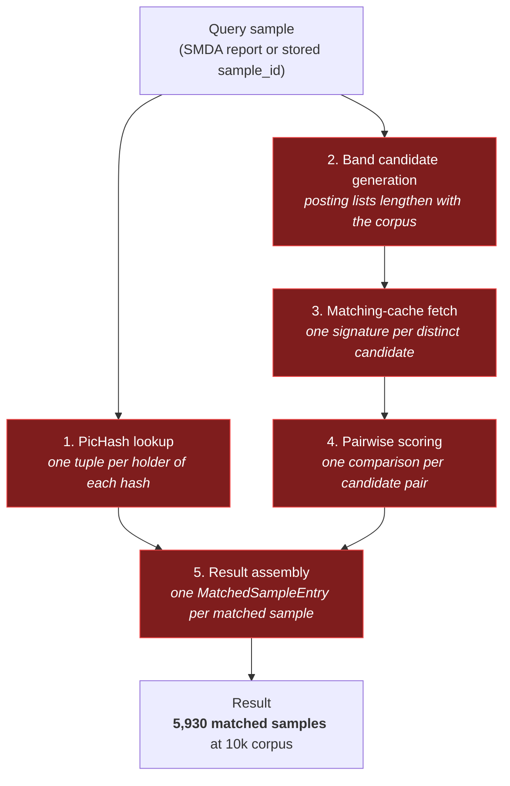
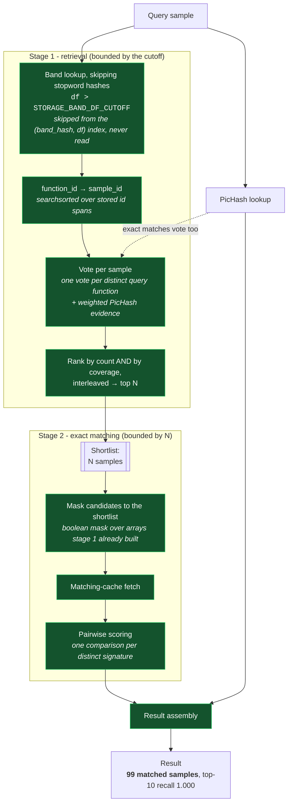

# 1-vs-N matching: architecture before and after

## Before: every stage linear in corpus size



All five stages grow with the corpus - and so does the output, which is the part no index can
fix. Measured from 993 to 10,000 samples: candidate pairs 10.8x, matched samples 10.4x,
latency 6.0x.

## After: bound the traversal, then bound the answer



## Why each piece is there

| Piece | Problem it solves | Cost if omitted |
|---|---|---|
| `STORAGE_BAND_DF_CUTOFF` + stored `df` | A band hash held by much of the corpus is a stopword: expensive to read, uninformative about *which* samples match | Stage 1 reads posting lists that grow linearly. Filtering on `$size` instead of a stored `df` saves nothing - mongod reads the document to measure it |
| `function_ranges` index | Candidate generation returns function ids; the shortlist needs samples | One lookup per candidate - the cost the shortlist exists to avoid |
| Vote by distinct query function | Ranks by how much of the query a sample explains | Counting pairs re-ranks by sample size |
| Rank by count **and** coverage | MCRIT scores samples by *percentage* matched, so small fully-matching samples matter | Measured: small high-scoring samples dropped out of the shortlist |
| PicHash votes | A sample can be reported through exact matches alone | Measured: samples in the unrestricted top ten were dropped |
| `MINHASH_MATCHING_SHORTLIST_SIZE` | Bounds fetch, scoring and assembly | Those three stay linear in corpus size |
| Signature dedup in scoring | Identical signatures score identically - comparing both is the same comparison twice | ~59% redundant scoring at 257 samples, ~96% projected at 1M |

## What is deliberately *not* bounded

**PicHash matching stays exact.** An exact, position-independent hash match is cheap to look up
and is the strongest evidence MCRIT has; it is reported whether or not the holding sample made
the shortlist. This is why sample-level recall can exceed what the shortlist size alone would
imply.

## Rollout

Both knobs default to **0 (off)**, so an upgraded instance behaves bit-identically until it opts
in. Two indexes want a one-time build on an existing database - neither is read until a
completeness flag vouches for it, so the old behaviour holds until they are built:

```python
storage.rebuildFunctionRangeIndex()   # required for shortlisting
storage.rebuildBandDfIndex()          # makes the df cutoff skip from the index
```

Measured build cost on 10,000 samples / 8.15M functions: 12.3 s and 131 s respectively.
